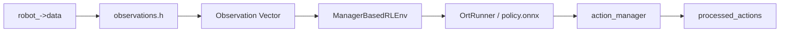
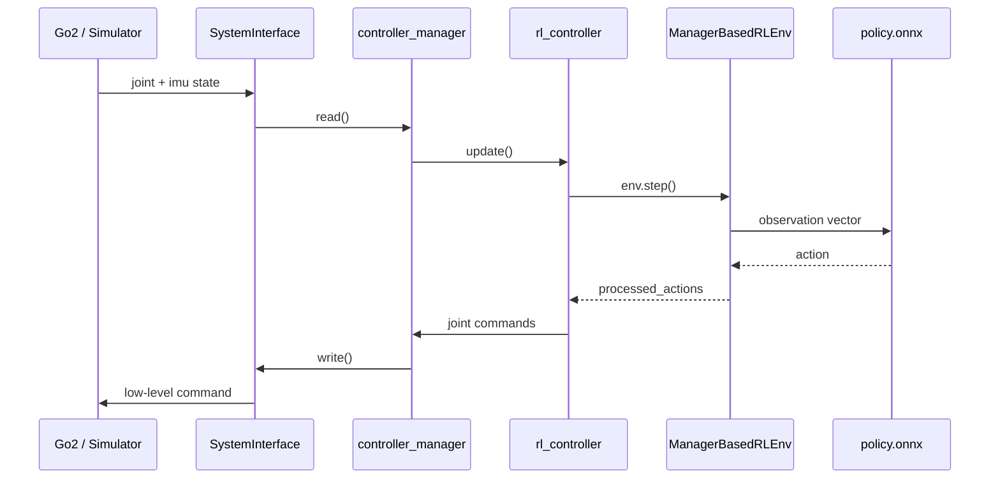

# legged_ros2 Data Flow

本文档聚焦当前 `Go2 + RL Controller` 链路的数据流，说明：

- 观测数据从哪里来
- 这些数据如何进入 policy
- policy 输出如何变成关节命令
- `/rl_cmd_vel` 和 `/heightmap` 在整条链路中的位置

[TOC]

## 1. 总览

```mermaid
flowchart LR
    A[Go2 Hardware / Simulator] --> B[legged_ros2_control<br/>SystemInterface]
    B --> C[controller_manager]
    C --> D[rl_controller]
    E[/rl_cmd_vel<br/>geometry_msgs/Twist] --> D
    F[/heightmap<br/>unitree_go/HeightMap] --> D
    D --> G[LeggedArticulation]
    G --> H[observations.h]
    H --> I[policy.onnx]
    I --> J[action_manager]
    J --> D
    D --> C
    C --> B
    B --> A
```

## 2. 原始数据来源

### 2.1 关节状态
@（12+12）=24-->joint_vel joint_pos
来源：`legged_ros2_control` 暴露的 state interfaces。

当前每个关节会提供：

- `position`
- `velocity`
- `effort`

读取入口：

- [joint_interface.hpp](/home/xcj/work/IsaacLab/legged_ws/src/legged_ros2/legged_ros2_controller/include/legged_ros2_controller/semantic_components/joint_interface.hpp:114)

主要函数：

- `get_joint_position()`
- `get_joint_velocity()`
- `get_joint_effort()`

### 2.2 IMU 状态
@ (3+3)=6-->angel_vel  projected_gravity
来源：`legged_ros2_control` 暴露的 IMU state interfaces。

当前使用的量包括：

- 四元数 `orientation`
- 角速度 `angular_velocity`
- 线加速度 `linear_acceleration`

在控制器里通过 ROS 2 自带 `semantic_components::IMUSensor` 读取。

### 2.3 速度命令
@ 3-->vel_cmd
来源：话题 `/rl_cmd_vel`

消息类型：

- `geometry_msgs/msg/Twist`

读取入口：

- [legged_rl_controller.cpp](/home/xcj/work/IsaacLab/legged_ws/src/legged_ros2/legged_rl_controller/src/legged_rl_controller.cpp:124)

当前配置来源：

- [rl.yaml](/home/xcj/work/IsaacLab/legged_ws/src/legged_ros2/legged_robot_description/go2_description/config/ros2_control/rl.yaml:173)

说明：

- 当前 `rl_controller` 已改为订阅 `/rl_cmd_vel`
- 不再直接用 `/cmd_vel`
- 这样可以避免和 `go2_wireless_controller` 发布的 `/cmd_vel` 冲突

### 2.4 高程图
@187 -->hightmap
来源：话题 `/heightmap`

消息类型：

- `unitree_go/msg/HeightMap`

读取入口：

- [legged_rl_controller.cpp](/home/xcj/work/IsaacLab/legged_ws/src/legged_ros2/legged_rl_controller/src/legged_rl_controller.cpp:133)

说明：

- 消息本身提供 `width`、`height`、`data`
- 当前 policy 期望 `height_scan` 维度为 `187`
- 运行时如果收到的 `data` 长度和 `187` 不一致，代码会做截断或补零适配

### 2.5 上一时刻动作
@12 -->last_action
来源：`action_manager` 缓存的上一控制周期动作。

消息类型：

- 无 ROS 消息类型

读取入口：

- [observations.h](/home/xcj/work/IsaacLab/legged_ws/src/legged_ros2/legged_rl_controller/include/legged_rl_controller/isaaclab/envs/mdp/observations/observations.h:93)

说明：

- `last_action` 不是来自外部 topic
- 它来自 `env->action_manager->action()`
- 当前用于把上一时刻 policy 输出重新作为 observation 的一部分输入给下一次推理

## 3. 从原始数据到机器人状态

原始接口和订阅消息不会直接送进 policy，而是先写入 `LeggedArticulation::data`。

关键入口：

- [legged_articulation.hpp](/home/xcj/work/IsaacLab/legged_ws/src/legged_ros2/legged_rl_controller/include/legged_rl_controller/legged_articulation.hpp:24)

其 `update()` 里主要做了这些事：

1. 从 `JointInterface` 读取关节位置和速度
2. 从 `IMUSensor` 读取四元数和角速度
3. 根据 IMU 四元数计算 `projected_gravity`
4. 从 `/rl_cmd_vel` 的 buffer 读取当前速度命令
5. 将上述数据写入 `robot_->data`

最终写入的数据包括：

- `joint_pos`
- `joint_vel`
- `root_ang_vel_b`
- `projected_gravity_b`
- `root_quat`
- `velocity_command`
- `height_scan`

## 4. Observation 是怎么来的

Observation 的实际映射定义在：

- [observations.h](/home/xcj/work/IsaacLab/legged_ws/src/legged_ros2/legged_rl_controller/include/legged_rl_controller/isaaclab/envs/mdp/observations/observations.h:1)

而哪些 observation 会被 policy 使用、顺序是什么、维度是多少，由：

- [IO_descriptors.yaml](/home/xcj/work/IsaacLab/legged_ws/src/legged_ros2/legged_robot_description/go2_description/config/rl_policy/IO_descriptors.yaml:1)

共同决定。

### 4.1 当前常用 observation 对应关系

| Observation | 来源 | 说明 |
| --- | --- | --- |
| `base_ang_vel` | IMU 角速度 | 机体坐标系下角速度 |
| `projected_gravity` | IMU 四元数 | 将世界重力投影到机体坐标系 |
| `generated_commands` | `/rl_cmd_vel` | 速度命令 `(vx, vy, wz)` |
| `joint_pos_rel` | 关节位置 | 相对默认站立位的关节位置 |
| `joint_vel_rel` | 关节速度 | 相对默认值的关节速度 |
| `last_action` | 上一时刻动作 | 上一次 action manager 的输入动作 |
| `height_scan` | `/heightmap` | 地形高度扫描 |

### 4.2 速度命令如何进入 observation

`/rl_cmd_vel` -> `cmd_vel_buffer_` -> `LeggedArticulation::data.velocity_command` -> `generated_commands`

对应代码：

- 订阅： [legged_rl_controller.cpp](/home/xcj/work/IsaacLab/legged_ws/src/legged_ros2/legged_rl_controller/src/legged_rl_controller.cpp:124)
- 写入 articulation： [legged_articulation.hpp](/home/xcj/work/IsaacLab/legged_ws/src/legged_ros2/legged_rl_controller/include/legged_rl_controller/legged_articulation.hpp:70)
- 生成 observation： [observations.h](/home/xcj/work/IsaacLab/legged_ws/src/legged_ros2/legged_rl_controller/include/legged_rl_controller/isaaclab/envs/mdp/observations/observations.h:101)

### 4.3 高程图如何进入 observation

`/heightmap` -> `heightmap_buffer_` -> `robot_->data.height_scan` -> `height_scan`

对应代码：

- 订阅： [legged_rl_controller.cpp](/home/xcj/work/IsaacLab/legged_ws/src/legged_ros2/legged_rl_controller/src/legged_rl_controller.cpp:133)
- 写入数据： [legged_rl_controller.cpp](/home/xcj/work/IsaacLab/legged_ws/src/legged_ros2/legged_rl_controller/src/legged_rl_controller.cpp:246)
- 生成 observation： [observations.h](/home/xcj/work/IsaacLab/legged_ws/src/legged_ros2/legged_rl_controller/include/legged_rl_controller/isaaclab/envs/mdp/observations/observations.h:115)

## 5. 从 observation 到 action

整条链路如下：



对应代码：

- 环境创建： [legged_rl_controller.cpp](/home/xcj/work/IsaacLab/legged_ws/src/legged_ros2/legged_rl_controller/src/legged_rl_controller.cpp:176)
- 推理执行： `env_->step()`
- 动作读取： [legged_rl_controller.cpp](/home/xcj/work/IsaacLab/legged_ws/src/legged_ros2/legged_rl_controller/src/legged_rl_controller.cpp:257)

动作定义在：

- [joint_actions.h](/home/xcj/work/IsaacLab/legged_ws/src/legged_ros2/legged_rl_controller/include/legged_rl_controller/isaaclab/envs/mdp/actions/joint_actions.h:1)

当前动作类型是：

- `joint_position_action`

也就是 policy 输出的动作最终会被解释成：

- 目标关节位置命令

## 6. 从 action 到电机命令

`processed_actions()` 输出后，`rl_controller` 会调用：

- [joint_interface.hpp](/home/xcj/work/IsaacLab/legged_ws/src/legged_ros2/legged_ros2_controller/include/legged_ros2_controller/semantic_components/joint_interface.hpp:152)

最终写出：

- 目标位置 `position`
- 目标速度 `velocity`
- 前馈力矩 `effort`
- 刚度 `kp`
- 阻尼 `kd`

然后由 `controller_manager` 驱动 `write()`，通过 `SystemInterface` 发给 Go2。

完整闭环：



## 7. 运行时排查建议

如果机器人不动，可以按这个顺序看：

1. `ros2 control list_controllers`
   确认 `rl_controller` 是否 `active`
2. `ros2 topic info /rl_cmd_vel -v`
   确认 `rl_controller` 是否真的订阅了 `/rl_cmd_vel`
3. `ros2 topic echo /rl_cmd_vel`
   确认命令是否持续发布
4. `ros2 topic info /heightmap -v`
   确认高程图是否存在
5. 检查 `IO_descriptors.yaml`
   确认 observation 项和 `policy.onnx` 匹配

## 8. 总结

当前 Go2 RL 数据流可以概括为：

- `ros2_control` 提供关节和 IMU
- `/rl_cmd_vel` 提供高层速度命令
- `/heightmap` 提供地形观测
- `LeggedArticulation` 汇总这些输入
- `observations.h` 将其编码为 policy 输入
- `policy.onnx` 输出关节动作
- `JointInterface` 将动作写回 ros2_control 命令接口

这就是当前分支的 RL 闭环主路径。
