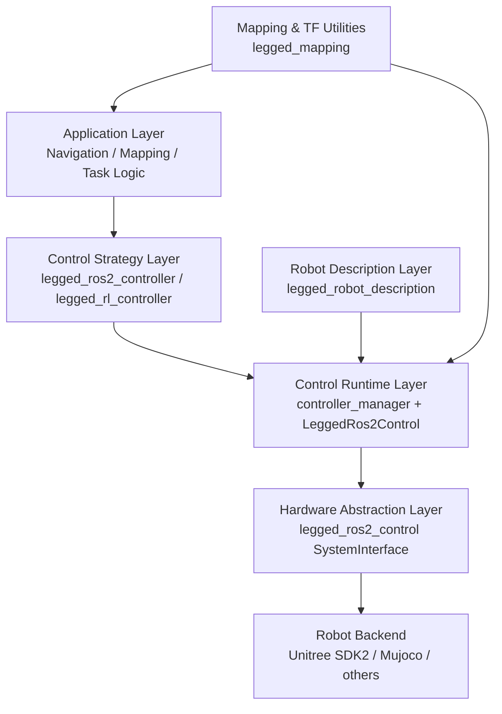
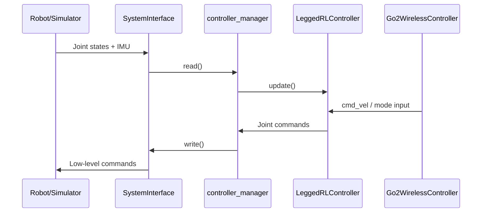
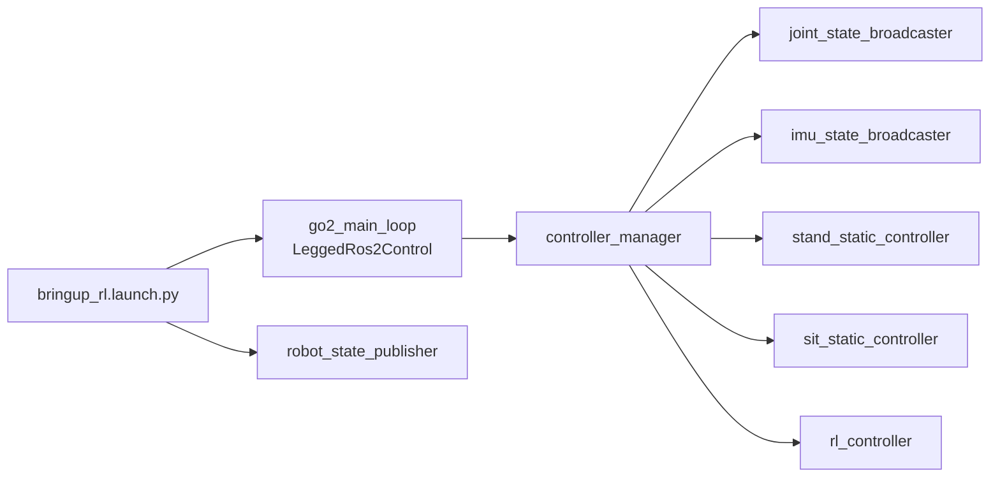

# legged_ros2 Design Philosophy and Architecture

> This document is auto-generated by Codex.

This document describes the design principles, package responsibilities, and runtime data flow of `legged_ros2`.

[TOC]

## 1. Design Philosophy

`legged_ros2` is designed to provide a practical ROS 2 software stack for legged robots with a clear separation of concerns:

1. **Layered architecture**: hardware access, controllers, robot description, and mapping helpers are decoupled.
2. **Controller plugin model**: different control strategies can run on the same hardware interface.
3. **Sim-to-real consistency**: upper-layer controllers interact with standard ros2_control interfaces.
4. **Task-oriented composition**: mapping/TF utilities are independent from the core control loop.
5. **Configuration-first operation**: launch and YAML files define behavior without hardcoding.

## 2. High-Level Architecture

## 3. Package Responsibilities

### 3.1 `legged_ros2_control`

Role: **control runtime and hardware integration**.

Main responsibilities:
- Owns `controller_manager` runtime loop (read-update-write).
- Loads SystemInterface plugins.
- Bridges low-level robot I/O (joints, IMU, command write).
- Provides main loop executables (e.g., `go2_main_loop`).

### 3.2 `legged_ros2_controller`

Role: **classical controller plugin set**.

Current plugins include:
- `legged_ros2_controller/LeggedController` (base controller logic)
- `legged_ros2_controller/StaticController`
- `legged_ros2_controller/RandomTrajController`
- `legged_ros2_controller/SeparateJointController`

Main responsibilities:
- Declare/consume joint and IMU interfaces.
- Produce joint-level commands.
- Provide basic motion behaviors (stand/sit/joint-level tests).

### 3.3 `legged_rl_controller`

Role: **reinforcement-learning controller plugin**.

Main responsibilities:
- Load ONNX policy and I/O descriptors.
- Build observations, run inference, decode actions.
- Convert policy output to joint commands.
- Integrate velocity command inputs (e.g., `cmd_vel`).

### 3.4 `legged_robot_description`

Role: **robot model and launch orchestration**.

Main responsibilities:
- Provide URDF/Xacro and robot parameters.
- Provide launch pipelines (RL/static/broadcasters).
- Provide ros2_control YAML configurations.

### 3.5 `legged_mapping`

Role: **mapping and TF helper utilities**.

Main nodes (current implementation):
- `mid360_imu_node`: IMU orientation estimation/filtering.
- `dual_imu_static_tf_node`: initializes static TF (`odom -> camera_init`, `body(lidar) -> base`) from dual IMUs.
- `gravity_alignment_node`: standalone gravity-alignment utility.

## 4. Runtime Data and Control Flow (Go2 + RL Example)

Key point:
- The control loop timing is driven by `controller_manager`.
- The wireless controller node issues high-level mode/switch commands, not direct motor writes.

## 5. Typical Bringup Pipeline

For mapping use cases, `legged_mapping` nodes can be launched in parallel to provide IMU/TF support.

## 6. Extension Guidelines

1. **Add a new robot**: implement/extend description + hardware interface first, then reuse controllers.
2. **Add a new control method**: implement it as a `controller_interface` plugin.
3. **Add mapping/fusion tools**: keep them in `legged_mapping` and communicate via TF/topics.
4. **Prefer configuration over code changes**: use launch/YAML for mode switching and tuning.

## 7. Summary

`legged_ros2` is a layered, plugin-based ROS 2 stack for legged robots: a unified hardware interface at the bottom, swappable controllers in the middle, and task-level composition (including mapping helpers) at the top.
