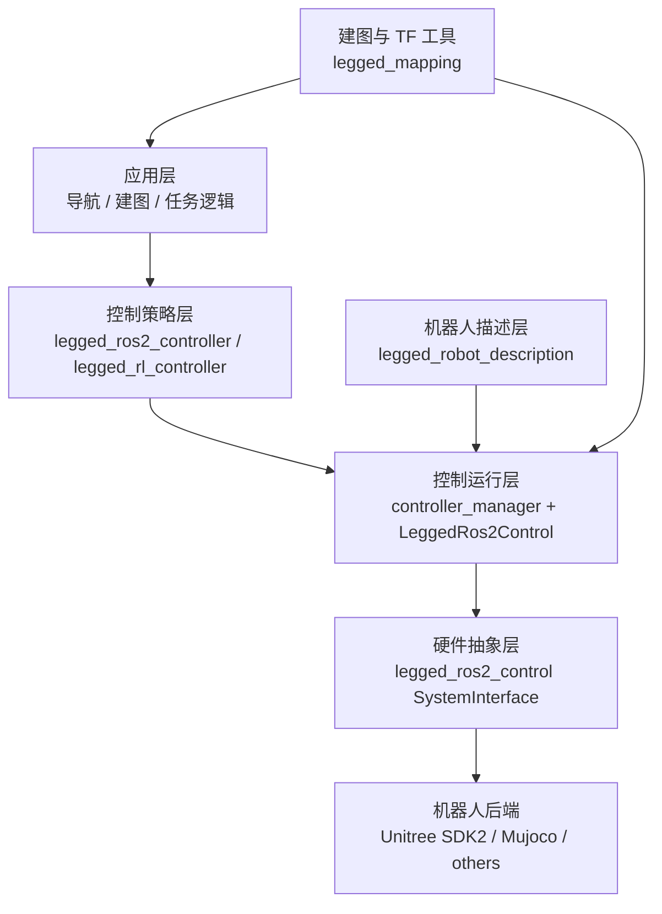
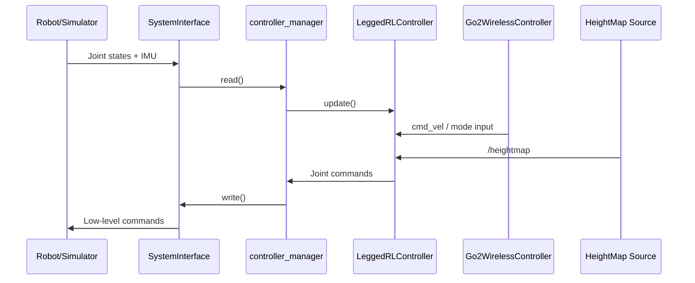
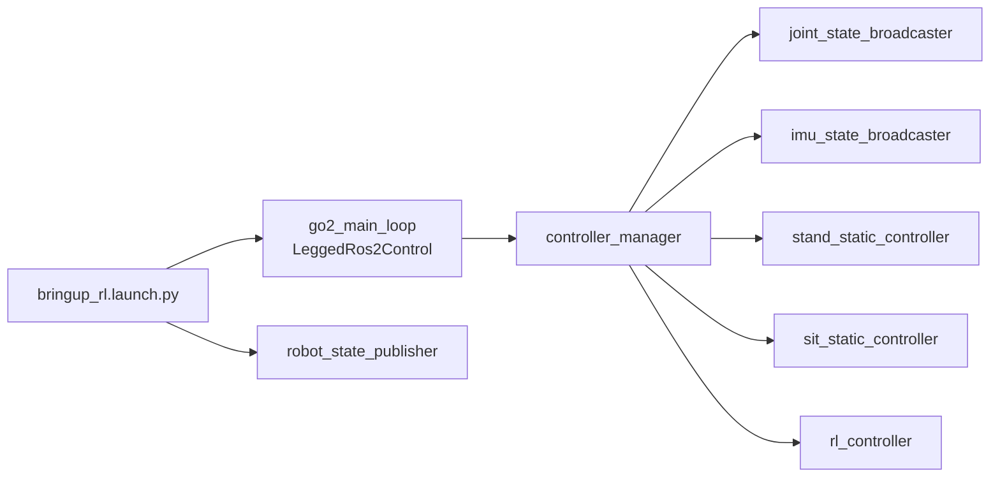

# legged_ros2 设计理念与系统架构

本文档描述 `legged_ros2` 的设计原则、各包职责以及运行时数据流。

[TOC]

## 1. 设计理念

`legged_ros2` 的目标是为足式机器人提供一套实用的 ROS 2 软件栈，并保持职责边界清晰：

1. **分层架构**：硬件访问、控制器、机器人描述和建图辅助逻辑解耦。
2. **控制器插件化**：不同控制策略可以复用同一套硬件接口。
3. **仿真到真机一致性**：上层控制器通过标准 `ros2_control` 接口交互。
4. **任务导向组合**：建图和 TF 工具独立于核心控制闭环。
5. **配置优先**：优先通过 launch/YAML 配置定义行为，而不是把逻辑硬编码在源码中。

## 2. 总体架构

## 3. 各包职责

### 3.1 `legged_ros2_control`

职责：**控制运行时和硬件集成**。

主要负责：

- 承载 `controller_manager` 的运行循环（read-update-write）。
- 加载 SystemInterface 插件。
- 桥接底层机器人 I/O，包括关节状态、IMU 和低层命令写出。
- 提供主循环可执行程序，例如 `go2_main_loop`。

### 3.2 `legged_ros2_controller`

职责：**传统控制器插件集合**。

当前包含的控制器有：

- `legged_ros2_controller/LeggedController`
- `legged_ros2_controller/StaticController`
- `legged_ros2_controller/RandomTrajController`
- `legged_ros2_controller/SeparateJointController`

主要负责：

- 声明并消费关节和 IMU 接口；
- 生成关节层命令；
- 提供起立、坐下、单关节测试等基础控制行为。

### 3.3 `legged_rl_controller`

职责：**强化学习控制器插件**。

主要负责：

- 加载 ONNX 策略和 `IO_descriptors.yaml`；
- 构建观测、执行推理、解码动作；
- 将策略输出转换为关节命令；
- 接收速度命令输入，例如 `cmd_vel`；
- 在当前代码中，还支持通过 `/heightmap` 生成 `height_scan` 地形观测。

### 3.4 `legged_robot_description`

职责：**机器人模型与启动编排**。

主要负责：

- 提供 URDF/Xacro 和机器人参数；
- 提供 RL / static / broadcasters 等启动流程；
- 提供 ros2_control 对应 YAML 配置。

### 3.5 `legged_mapping`

职责：**建图和 TF 辅助工具**。

当前节点包括：

- `mid360_imu_node`
- `dual_imu_static_tf_node`
- `gravity_alignment_node`

## 4. 运行时数据流（以 Go2 + RL 为例）

关键点：

- 控制周期由 `controller_manager` 驱动。
- 无线手柄节点发的是模式切换和高层速度命令，而不是直接写电机。
- 当前 Go2 RL 链路已经能把 `/heightmap` 数据接入为 `height_scan` 观测。

## 5. 典型启动流程

如果要配合建图，`legged_mapping` 节点可以并行启动，为 IMU 和 TF 提供支持。

## 6. 扩展建议

1. **增加新机器人**：先补 description 和 hardware interface，再复用现有控制器。
2. **增加新控制方式**：优先实现为 `controller_interface` 插件。
3. **增加建图/融合工具**：放在 `legged_mapping` 中，通过 TF 或 topic 交互。
4. **优先改配置**：尽量通过 launch/YAML 调整模式和参数，而不是直接改业务逻辑。

## 7. 总结

`legged_ros2` 是一套分层、插件化的足式机器人 ROS 2 栈：底层是统一硬件接口，中间是可替换控制器，上层再组合导航、建图和其他任务逻辑。
