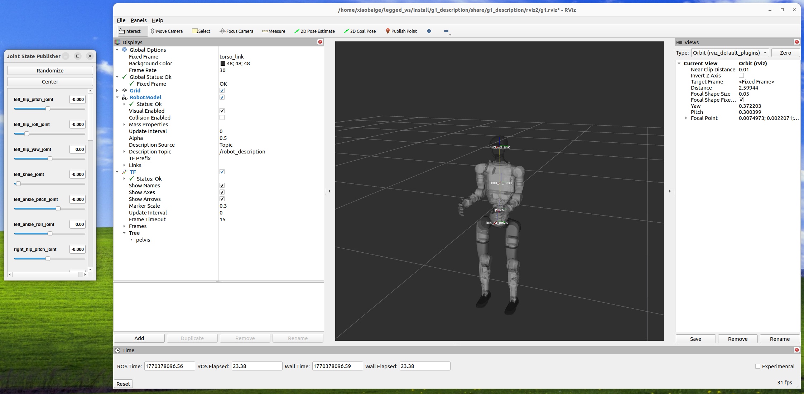

# How to Add Your Robot to legged_ros2


## Robot Description Package

Create a ros2 package by running the following command in the terminal:

```bash
ros2 pkg create --build-type ament_cmake <your_robot_description> --dependencies legged_ros2_controller legged_ros2_control
```

Create folders under the package: 
```bash
cd <your_robot_description>
mkdir urdf # for urdf and xacro files
mkdir meshes # (optional) for stl/dae files of the robot, you might need to modify the model path in the urdf/xacro file accordingly
mkdir config # for config files
mkdir rviz2 # for rviz files
mkdir launch # for launch scripts
```

Then add the following command in CMakeLists.txt: 
```cmake
install(
  DIRECTORY config launch meshes urdf rviz2
  DESTINATION share/${PROJECT_NAME}
)
```

and build the workspace, so that the urdf files can be found by ROS2:

```bash
colcon build --packages-select <your_robot_description> --symlink-install
```

### URDF/XACRO Files

Prepare the robot urdf file. You can get it from the robot manufacturer or create it yourself using a CAD model.

Then according to the urdf file, create a xacro file for the robot, where `xacro:macro` is used to define a macro for the robot, which would be included in the main xacro file. You can refer to `g1_description/urdf/g1_29dof_lock_waist_rev_1_0.urdf` and `g1_description/urdf/g1_29dof_lock_waist_rev_1_0_macro.urdf.xacro` for an example.

> You might need to modify the mesh filename in urdf/xacro file so that it can find the right path to the mesh file, like `"package://g1_description/meshes/pelvis_contour_link.STL"`

Create a xacro file which contains ros2_control related information, such as hardware plugins, command_interface, and state_interface. You can refer to `g1_description/urdf/g1_29dof_lock_waist_rev_1_0.ros2_control.urdf.xacro` for an example, where the ROS2 control config for revolute joints can be generated by running a helper script `g1_description/scripts/print_ros2_control.py`. You can copy the script to your own robot's description package, modify it and then get the corresponding ros2_control tag in the terminal output.

> The plugin in ros2_control tag should be modified according to the actual hardware interface of your robot, which would be defined later. You can leave it now and modify it later when you define the hardware interface for your robot.

Finally, you can include the main xacro file in the launch file and use it as robot description in ROS2. You can refer to `g1_description/urdf/g1_29dof_lock_waist_rev_1_0.urdf.xacro` for an example.

You can validate the xacro file by running the following command in the terminal:

```bash
# make sure you have already built the workspace so that the xacro file can be found by ROS2
xacro your_robot.urdf.xacro > test.urdf
```
If no error is reported, then the xacro file is valid.

### Visualization by RViz2

You can use RViz2 to visualize the robot model and further check if the urdf/xacro file is correct. 

* Create a rviz2 config file for your robot in `rviz2`. You can copy the `g1_description/rviz2/g1.rviz` to your own description package and change its file name. You need not to change the content of the rviz2 config file directly because we will later change it in the UI. 
* Create a launch script in `launch` folder. You can refer to `g1_description/launch/view_robot.launch.py` for an example. Modify the parameters in the launch file according to your own robot

Then you can run the launch file to visualize the robot in RViz2:

```bash
# in workspace root
colcon build --packages-select <your_robot_description> --symlink-install
source install/setup.bash
ros2 launch <your_robot_description> view_robot.launch.py
```

If the robot model can be visualized in RViz2, then the urdf/xacro file is correct. 

You can further use the joint state publisher GUI to check if the joints can be moved as expected. 

Modification can be made in the RViz2 (e.g., the Fixed Frame in the Global Options) and save the rviz2 config file for later use.



## Hardware interface

This section describes how to implement a ROS2 control hardware interface for your robot inside `legged_ros2_control`. It is recommended to read the Go2 implementation first and follow its coding style and structure. The repository already includes a complete `unitree_go2` example; you can mirror its directory layout and code organization.

### Directory layout

Create a new robot directory under `legged_ros2_control`, for example:

```bash
src/legged_ros2/legged_ros2_control/include/legged_ros2_control/robots/<your_robot>/
src/legged_ros2/legged_ros2_control/src/robots/<your_robot>/
```

Using Unitree G1 as an example, the directory typically contains:

* `<robot>_lowlevel_node.hpp/.cpp`: low-level communication (subscribe lowstate, publish lowcmd)
* `<robot>_system_interface.hpp/.cpp`: ROS2 control system interface implementation
* `<robot>_wireless_controller.hpp/.cpp`: optional, joystick input -> cmd_vel and controller switching
* `motor_crc*.h/.cpp`: CRC calculation and joint index mapping
* `<robot>_main_loop.cpp`: start `LeggedRos2Control` and the wireless controller node

### Key implementation points

1. **Low-level node (LowLevelNode)**
   * Subscribe to `lowstate` (high frequency) or `lf/lowstate` (low frequency), publish `/lowcmd`.
   * Compute CRC in `publish_lowcmd()` before sending.
   * Initialize all motor_cmd fields in `init_lowcmd_()`.

2. **System interface (SystemInterface)**
   * Create the low-level node in `on_init()` and parse `enable_lowlevel_write`.
   * `build_joint_data_()` maps joint names to motor indices in the SDK/messages.
   * `read()` fills joint states and IMU data from `lowstate`.
   * `write()` writes commands into `lowcmd` and publishes (if writing is enabled).

3. **Wireless controller (optional)**
   * Subscribe to low-level messages (e.g., Unitree HG `LowState.wireless_remote`).
   * Parse buttons and sticks, publish `/cmd_vel`, and support controller switching.

### Build and plugin updates

After implementing the code, update these files to enable the plugin:

* `legged_ros2_control/CMakeLists.txt`: add `add_subdirectory(src/robots/<your_robot>)`
* `legged_ros2_control/src/robots/<your_robot>/CMakeLists.txt`: add library and executable targets
* `legged_ros2_control/legged_ros2_control_plugins.xml`: register the hardware plugin
* `legged_ros2_control/package.xml`: add message dependencies (e.g., `unitree_go` / `unitree_hg`)

### URDF alignment

* Joint names must exactly match the `ros2_control` joint names; otherwise `build_joint_data_()` will fail.
* The IMU count must match the `ros2_control` sensor list (current example supports only one IMU).

Finally, build and run:

```bash
colcon build --packages-select legged_ros2_control
ros2 run legged_ros2_control <your_robot>_main_loop
```


